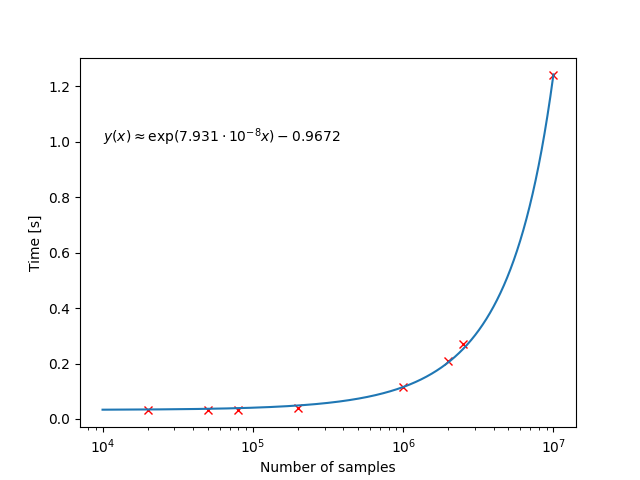

# Bubbles GUI Readme
## Introduction
GUI for automatic generator voltage tunning based on oscilloscope (Agilent Technologies MSO9404A) readout.


## Benchmarking
The are limitations on transfer speeds beetween Oscilloscope and PC. Transfer time is a quadratic function with neglegible first term:

$$y(x)\approx3.468\cdot10^{-15}x^2 + 8.657\cdot10^{-8}x + 0.0276.$$



Benchmarking was performed on computer with AMD Ryzen 7 3700X 8-Core Processor, so resoults may vary based on that. Record length is a quantity of points in a single acquisition.


## Configuring udev
If you cannot access your device without running your script as root follow the link: [Python USBTMC Readme](http://alexforencich.com/wiki/en/python-usbtmc/readme)
or are running it on Windows (untested).

### In case of issues try this
https://stackoverflow.com/questions/50625363/usberror-errno-13-access-denied-insufficient-permissions

1. Run line to create usb- udev file:
```console
sudo echo -e '# USBTMC instruments
# Agilent MSO7104
SUBSYSTEMS=="usb", ACTION=="add", ATTRS{idVendor}=="0957", ATTRS{idProduct}=="900d", GROUP="usbtmc", MODE="0666"
# Tektronix AFG3102
SUBSYSTEMS=="usb", ACTION=="add", ATTRS{idVendor}=="0699", ATTRS{idProduct}=="0343", GROUP="usbtmc", MODE="0660"
# Devices
KERNEL=="usbtmc/*",       MODE="0660", GROUP="usbtmc"
KERNEL=="usbtmc[0-9]*",   MODE="0660", GROUP="usbtmc"' >> /etc/udev/rules.d/usbtmc.rules
```
    where the vendor and product ID must go in hex and without the 0x.

2. Refresh udev

```console
sudo udevadm control --reload-rules && sudo udevadm trigger
```

3. <span style="color: red;">Disconnect and re-connect the USB device.</span>


## Using the programm
1. Turn oscilloscope on.
2. Turn generator on.
3. Make sure that both devices are plugged in to controller PC and can be detected using `lsusb`.
4. Run the script `python main.py`.

## Dependencies
### Pip
* matplotlib==3.9.2
* numba==0.60.0
* numpy==2.1.0
* python_ivi==0.14.9
* python_usbtmc==0.8
* samplerate==0.2.1
### OS
#### Linux based OS is necessary due to shared memory between processes not working on windows
* Tkinter 8.6.12